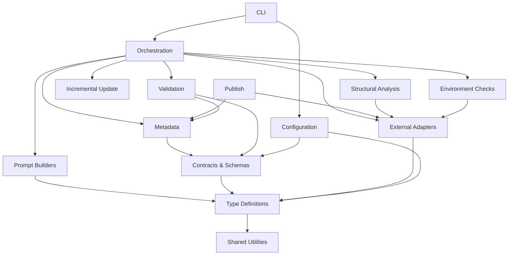

# Liminal DocGen — Repository Overview

**Liminal DocGen** (`liminal-docgen`) is an AI-powered documentation generation tool that analyzes a repository's source code and produces a structured wiki. It scans files for structural information (exports, imports, call graphs), clusters them into logical modules, generates markdown documentation via LLM, validates the output, and optionally publishes it as a GitHub pull request.

- **131 source files** | **184 relationships** | **18 modules**
- Commit: `2e89c5e`

---

## Architecture at a Glance

The codebase follows a layered architecture. Foundational layers (types, utilities, contracts) sit at the bottom with no upward dependencies. Mid-level modules (adapters, analysis, config, metadata) provide core capabilities. The orchestration layer wires everything into a pipeline, and the CLI and publish modules form the user-facing surface.

---

## Module Index

| Module | Responsibility | Wiki Page |
|--------|---------------|-----------|
| **[CLI](cli.md)** | Command definitions, argument parsing, human/JSON output, progress rendering, signal-based cancellation, exit codes | [cli.md](cli.md) |
| **[Configuration](configuration.md)** | Layered config resolution: built-in defaults → file-based config → CLI arguments | [configuration.md](configuration.md) |
| **[Contracts & Schemas](contracts-and-schemas.md)** | Zod schemas enforcing data shapes at every pipeline boundary | [contracts-and-schemas.md](contracts-and-schemas.md) |
| **[Environment Checks](environment-checks.md)** | Pre-flight validation of Git, Python, tree-sitter parsers, and detected languages | [environment-checks.md](environment-checks.md) |
| **[External Adapters](external-adapters.md)** | Wrappers for subprocess execution, Git CLI, GitHub CLI, Python runtime, and the Agent SDK | [external-adapters.md](external-adapters.md) |
| **[Incremental Update](incremental-update.md)** | Differential update logic — maps changed files to affected modules for selective regeneration | [incremental-update.md](incremental-update.md) |
| **[Metadata](metadata.md)** | Read/write/validate generation metadata: timestamps, commit hashes, staleness detection | [metadata.md](metadata.md) |
| **[Orchestration](orchestration.md)** | Core pipeline: env check → analysis → planning → generation → review → metadata write | [orchestration.md](orchestration.md) |
| **[Prompt Builders](prompt-builders.md)** | LLM prompt construction for clustering, module docs, overview pages, and quality review | [prompt-builders.md](prompt-builders.md) |
| **[Publish](publish.md)** | Push generated docs to a Git branch and open a GitHub pull request | [publish.md](publish.md) |
| **[Shared Utilities](shared-utilities.md)** | Leaf-layer helpers: error extraction, language-to-extension mapping, package entry point | [shared-utilities.md](shared-utilities.md) |
| **[Structural Analysis](structural-analysis.md)** | Python-based AST parsing, raw output normalization, and the TypeScript adapter | [structural-analysis.md](structural-analysis.md) |
| **[Type Definitions](type-definitions.md)** | Shared TypeScript interfaces and utility types used across the entire codebase | [type-definitions.md](type-definitions.md) |
| **[Validation](validation.md)** | Post-generation checks: cross-links, file presence, Mermaid syntax, metadata shape, module tree | [validation.md](validation.md) |

### Test & Support Modules

| Module | Responsibility | Wiki Page |
|--------|---------------|-----------|
| **[Unit Tests](unit-tests.md)** | Per-subsystem test suites covering all major modules | [unit-tests.md](unit-tests.md) |
| **[Integration & Live Tests](integration-and-live-tests.md)** | End-to-end, determinism, failure-mode, and live-infrastructure tests | [integration-and-live-tests.md](integration-and-live-tests.md) |
| **[Test Helpers](test-helpers.md)** | Mock Agent SDK, CLI runner, fixture paths, Git helpers, temp directories | [test-helpers.md](test-helpers.md) |
| **[Test Fixtures](test-fixtures.md)** | Static fixture repos: multi-language, no-git, valid-TypeScript samples | [test-fixtures.md](test-fixtures.md) |

---

## Pipeline Flow

The documentation generation pipeline proceeds through these stages:

1. **Environment Check** — verify Git, Python, and parsers are available
2. **Configuration Resolution** — merge defaults, file config, and CLI args
3. **Structural Analysis** — scan the repo and extract an AST-based dependency graph
4. **Module Planning** — cluster files into logical modules via LLM
5. **Incremental Diff** *(optional)* — compare with prior state, scope regeneration
6. **Module Generation** — generate a markdown page per module via LLM
7. **Overview Generation** — produce the top-level repository overview
8. **Validation & Quality Review** — run integrity checks and LLM-based review
9. **Metadata Write** — persist generation metadata for future incremental runs
10. **Publish** *(optional)* — push to branch and open a PR

---

## Next Steps

Dive into any module page listed above for detailed component inventories, dependency diagrams, and API documentation. A good starting path:

1. **[Type Definitions](type-definitions.md)** — understand the shared data model
2. **[Orchestration](orchestration.md)** — see how the pipeline is wired together
3. **[Structural Analysis](structural-analysis.md)** — learn how code is parsed
4. **[CLI](cli.md)** — explore the user-facing entry points
